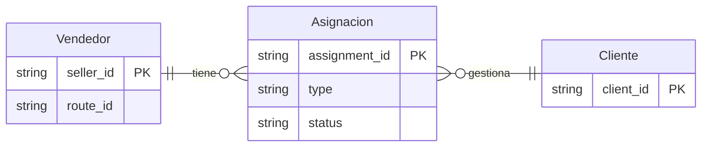

# Asignaciones

Las asignaciones en Reten definen la relación entre vendedores y los clientes que tienen a su cargo. Esta entidad permite gestionar qué vendedor es responsable de cada cliente, facilitando la organización del trabajo en terreno y el seguimiento de las relaciones comerciales.

## Modelo de Relaciones



## Estructura de Datos

```json
{
  // Identificadores
  "assignment_id": "string",      // Identificador único de la asignación (not null)
  "seller_id": "string",         // Identificador del vendedor (not null)
  "client_id": "string",          // Identificador del cliente (not null)
  
  // Información básica
  "description": "string",       // Descripción de la asignación
  "type": "string",             // Tipo de asignación: "primary", "secondary", "temporary"
  
  // Marcas temporales
  "created_at": "timestamp",    // Fecha de creación (not null)
  "updated_at": "timestamp",    // Fecha de última actualización (not null)

  // Estado
  "status": "string",            // Estado actual de la asignación (active, inactive, pending, completed, transferred)

  // Atributos personalizados
  "attributes": [{
    "key": "string",
    "value": "string",
    "type": "string"            // Tipo de valor (string, number, date, boolean)
  }]
}
```

## Campos Detallados

### Identificadores

| Campo         | Tipo   | Requerido | Descripción                  |
| ------------- | ------ | --------- | ---------------------------- |
| assignment_id | string | Sí        | Identificador único en Reten |
| seller_id     | string | Sí        | Identificador del vendedor   |
| client_id     | string | Sí        | Identificador del cliente    |

### Información Básica

| Campo       | Tipo   | Requerido | Descripción           |
| ----------- | ------ | --------- | --------------------- |
| description | string | No        | Descripción detallada |
| type        | string | Sí        | Tipo de asignación    |

**Tipos de Asignación:**
- `primary`: Vendedor principal del cliente
- `secondary`: Vendedor secundario o de apoyo
- `temporary`: Asignación temporal o de reemplazo

### Estado

**Estados Válidos:**
- `active`: Asignación activa y vigente
- `inactive`: Asignación temporalmente suspendida
- `pending`: Asignación pendiente de inicio
- `completed`: Asignación finalizada
- `transferred`: Asignación transferida a otro vendedor

## Validaciones

### Validaciones Generales

#### Identificadores
- `assignment_id` debe ser único en todo el sistema
- `seller_id` debe corresponder a un vendedor existente y activo
- `client_id` debe corresponder a un cliente existente y activo

#### Tipos y Estados
- `type` debe ser uno de los tipos válidos
- Un cliente debe tener al menos un vendedor con tipo "primary"

### Validaciones de Negocio

- Un cliente no puede tener más de un vendedor con tipo "primary" activo
- Un vendedor no puede tener asignaciones superpuestas para el mismo cliente

## Ejemplos de Uso

### Ejemplo Básico - Asignación Principal

```json
{
  "assignment_id": "ASG_001",
  "seller_id": "SLR_001",
  "client_id": "CLT_001",
  "description": "Asignación Principal Zona Norte",
  "type": "primary",
  "created_at": "2024-03-19T10:00:00Z",
  "updated_at": "2024-03-19T10:00:00Z",
  "status": "active",
  "attributes": []
}
```

### Ejemplo Completo - Asignación Temporal

```json
{
  "assignment_id": "ASG_002",
  "seller_id": "SLR_002",
  "client_id": "CLT_001",
  "description": "Reemplazo temporal por período de vacaciones del vendedor principal",
  "type": "temporary",
  "created_at": "2024-01-10T10:00:00Z",
  "updated_at": "2024-01-10T10:00:00Z",
  "status": "completed",
  "attributes": [{
    "key": "replacement_reason",
    "value": "vacation",
    "type": "string"
  }]
}
```

### Asignación con Período

```json
{
  "assignment_id": "ASG_002",
  "seller_id": "SELLER_002",
  "route_id": "ROUTE_002",
  "status": "scheduled",
  "period": {
    "start_date": "2024-01-01",
    "end_date": "2024-12-31"
  },
  "created_at": "2024-01-10T10:00:00Z",
  "updated_at": "2024-01-10T10:00:00Z"
}
```

## Notas de Implementación

### Gestión de Cambios

#### Actualización de Datos
- Los cambios en asignaciones activas deben notificar a los vendedores afectados
- Mantener historial de cambios de asignaciones
- Registrar motivos de cambios de estado

#### Transiciones
- Documentar proceso de transferencia entre vendedores
- Manejar período de transición para cambios permanentes
- Gestionar solapamiento en asignaciones temporales

### Consideraciones de Seguridad

#### Protección de Datos
- Validar permisos por territorio/zona
- Registrar accesos y modificaciones
- Proteger información comercial sensible

#### Compliance
- Respetar límites de carga de trabajo
- Mantener registro de asignaciones históricas
- Validar conflictos de interés

## Integración con Otros Sistemas

### APIs

#### Endpoints Principales
```
GET    /api/v1/assignments
GET    /api/v1/assignments/{assignment_id}
POST   /api/v1/assignments
PUT    /api/v1/assignments/{assignment_id}
DELETE /api/v1/assignments/{assignment_id}

GET    /api/v1/sellers/{seller_id}/assignments
GET    /api/v1/clients/{client_id}/assignments
```

### Webhooks

#### Eventos Disponibles
- `assignment.created`
- `assignment.updated`
- `assignment.deleted`
- `assignment.status_changed`
- `assignment.transferred`

#### Formato de Payload
```json
{
  "event": "assignment.updated",
  "timestamp": "2024-03-19T14:30:00Z",
  "data": {
    "assignment_id": "string",
    "changes": [{
      "field": "string",
      "old_value": "any",
      "new_value": "any"
    }]
  }
}
```

## Preguntas Frecuentes

**¿Cómo manejar reemplazos temporales?**
- Crear nueva asignación con rol "temporary"
- Definir período de vigencia específico
- Mantener asignación principal en estado "active"

**¿Cómo gestionar transferencias permanentes?**
- Finalizar asignación actual (status: "transferred")
- Crear nueva asignación con nuevo vendedor
- Mantener historial de transferencia

**¿Cómo afectan las asignaciones a las rutas?**
- Las rutas solo pueden incluir clientes asignados al vendedor
- Los cambios en asignaciones pueden requerir actualización de rutas
- Se validan permisos de visita antes de crear rutas
