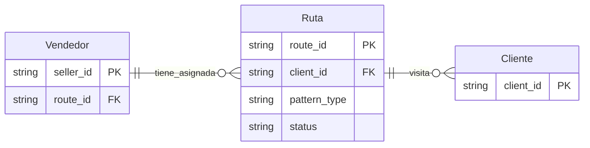

# Rutas

Las rutas en Reten definen cómo los vendedores visitan sus clientes asignados, permitiendo una planificación eficiente de tareas y visitas. Una ruta representa ya sea un patrón recurrente de visitas o fechas específicas programadas para visitar los clientes en la cartera del vendedor.

## Modelo de Relaciones



## Estructura de Datos

```json
{
  // Identificadores
  "route_id": "string",         // Identificador principal de la ruta (not null)
  "client_id": "string",        // Identificador del cliente a visitar (not null)
  
  // Información básica
  "description": "string",      // Descripción de la ruta
  
  // Configuración de la ruta
  "pattern_type": "string",     // Tipo de patrón: "recurring" o "specific" (not null)
  "visit_date": "date",         // Fecha específica de visita (requerido si pattern_type es "specific")
  "recurring_pattern": {        // Patrón recurrente (requerido si pattern_type es "recurring")
    "frequency": "string",      // "weekly", "monthly", "custom"
    "days": ["string"],        // Días de la semana ["MONDAY", "TUESDAY", etc.]
    "week_of_month": "number",  // Para patrones mensuales (1-5)
    "interval": "number"        // Para patrones personalizados
  },
  
  // Marcas temporales
  "created_at": "timestamp",   // Fecha de creación (not null)
  "updated_at": "timestamp",   // Última actualización (not null)

  // Estado
  "status": "string",           // Estado actual de la ruta (active, inactive, archived, draft)

  // Atributos personalizados
  "attributes": [{
    "key": "string",
    "value": "string",
    "type": "string"           // Tipo de valor (string, number, date, boolean)
  }]
}
```

## Campos Detallados

### Identificadores

| Campo     | Tipo   | Requerido | Descripción                         |
| --------- | ------ | --------- | ----------------------------------- |
| route_id  | string | Sí        | Identificador único en Reten        |
| client_id | string | Sí        | Identificador del cliente a visitar |

### Información Básica

| Campo        | Tipo   | Requerido | Descripción               |
| ------------ | ------ | --------- | ------------------------- |
| description  | string | No        | Descripción detallada     |
| pattern_type | string | Sí        | Tipo de patrón de visitas |

### Estado

**Estados Válidos:**
- `active`: Ruta activa y en uso
- `inactive`: Ruta temporalmente desactivada
- `archived`: Ruta archivada y no disponible para uso
- `draft`: Ruta en proceso de creación

## Validaciones

### Validaciones Generales

#### Identificadores
- `route_id` debe ser único en todo el sistema
- `client_id` debe corresponder a un cliente existente y asignado al vendedor

#### Fechas
- `created_at` no puede ser posterior a `updated_at`
- `visit_date` debe ser válida y en formato ISO 8601 cuando pattern_type es "specific"
- Las fechas específicas de visita no pueden ser en el pasado

#### Patrones
- Si `pattern_type` es "specific", debe tener una `visit_date` válida
- Si `pattern_type` es "recurring", debe tener un `recurring_pattern` válido
- Los días en `recurring_pattern.days` deben ser días válidos de la semana

### Validaciones de Negocio

- Un vendedor no puede tener visitas programadas simultáneas en diferentes clientes
- El cliente debe pertenecer a la cartera del vendedor
- Los patrones recurrentes no pueden tener intervalos menores a 1 día

## Ejemplos de Uso

### Ejemplo Básico - Ruta Recurrente

```json
{
  "route_id": "RTE_001",
  "client_id": "CLT_001",
  "description": "Visita semanal cliente principal zona norte",
  "pattern_type": "recurring",
  "recurring_pattern": {
    "frequency": "weekly",
    "days": ["MONDAY", "THURSDAY"]
  },
  "created_at": "2024-03-19T10:00:00Z",
  "updated_at": "2024-03-19T10:00:00Z",
  "status": "active",
  "attributes": []
}
```

### Ejemplo Completo - Ruta con Fecha Específica

```json
{
  "route_id": "RTE_002",
  "client_id": "CLT_002",
  "description": "Visita especial campaña navideña",
  "pattern_type": "specific",
  "visit_date": "2024-12-01",
  "created_at": "2024-03-19T10:00:00Z",
  "updated_at": "2024-03-19T10:00:00Z",
  "status": "active",
  "attributes": [{
    "key": "campaign",
    "value": "navidad_2024",
    "type": "string"
  }, {
    "key": "priority",
    "value": "1",
    "type": "number"
  }]
}
```

### Ruta con Territorios

```json
{
  "route_id": "ROUTE_002",
  "name": "Ruta Norte",
  "description": "Ruta del sector norte de Santiago",
  "status": "active",
  "territories": ["SANTIAGO_NORTE", "PROVIDENCIA_NORTE"],
  "created_at": "2024-03-19T10:00:00Z",
  "updated_at": "2024-03-19T10:00:00Z"
}
```

## Notas de Implementación

### Gestión de Cambios

#### Actualización de Datos
- Las modificaciones a rutas activas deben notificar a los vendedores afectados
- Los cambios en fechas específicas requieren confirmación del vendedor
- Mantener historial de cambios en patrones de visita

#### Sincronización
- Sincronizar cambios con calendarios de vendedores
- Propagar actualizaciones a sistemas de tareas
- Manejar conflictos de horarios

### Consideraciones de Seguridad

#### Protección de Datos
- Validar permisos de acceso por territorio/zona
- Registrar cambios en patrones de visita
- Proteger información sensible de clientes

#### Compliance
- Respetar horarios laborales y días festivos
- Cumplir con restricciones de visitas por zona
- Mantener registro de visitas realizadas

## Integración con Otros Sistemas

### APIs

#### Endpoints Principales
```
GET    /api/v1/routes
GET    /api/v1/routes/{route_id}
POST   /api/v1/routes
PUT    /api/v1/routes/{route_id}
DELETE /api/v1/routes/{route_id}

GET    /api/v1/routes/{route_id}/visits
POST   /api/v1/routes/{route_id}/visits
PUT    /api/v1/routes/{route_id}/visits/{visit_id}
DELETE /api/v1/routes/{route_id}/visits/{visit_id}
```

### Webhooks

#### Eventos Disponibles
- `route.created`
- `route.updated`
- `route.deleted`
- `route.status_changed`
- `route.visit_added`
- `route.visit_updated`
- `route.visit_deleted`

#### Formato de Payload
```json
{
  "event": "route.updated",
  "timestamp": "2024-03-19T14:30:00Z",
  "data": {
    "route_id": "string",
    "changes": [{
      "field": "string",
      "old_value": "any",
      "new_value": "any"
    }]
  }
}
```

## Preguntas Frecuentes

**¿Cómo manejar cambios en los patrones de visita?**
- Los cambios en patrones recurrentes aplican desde la siguiente ocurrencia
- Las modificaciones a fechas específicas requieren notificación al vendedor
- Se debe mantener un historial de cambios en los patrones

**¿Cómo gestionar conflictos de horarios?**
- El sistema valida superposición de visitas
- Se notifica al vendedor de conflictos potenciales
- Se pueden sugerir horarios alternativos

**¿Cómo se integra con el sistema de tareas?**
- Las tareas se pueden asignar a visitas específicas
- Se sincronizan automáticamente con el calendario del vendedor
- Se pueden definir tareas recurrentes por patrón de visita
