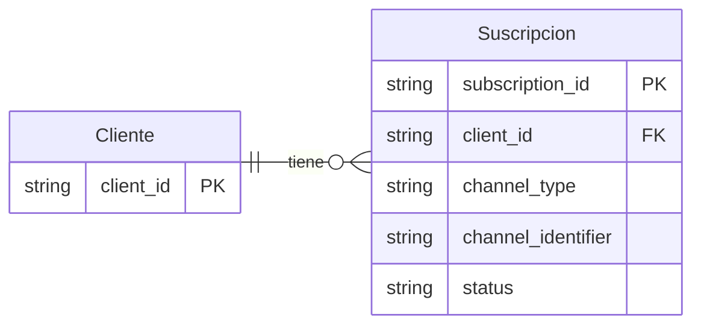

# :material-bell: Suscripciones

Las suscripciones a canales representan las preferencias de comunicación y notificaciones de los usuarios en la plataforma Reten. Esta entidad almacena la información sobre los canales de comunicación, consentimientos, y configuraciones específicas para cada usuario.

## Modelo de Relaciones



## Estructura de Datos

```json
{
  // Identificadores
  "subscription_id": "string",    // Identificador único de la suscripción (not null)
  "client_id": "string",           // Identificador del cliente (not null)

  // Información del canal
  "channel": {
    "type": "string",            // Tipo de canal (email, sms, push, whatsapp) (not null)
    "identifier": "string",      // Identificador del canal (email, teléfono, token) (not null)
    "name": "string",            // Nombre descriptivo del canal
    "status": "string"           // Estado del canal (active, inactive, pending, blocked)
  },

  // Consentimientos y preferencias
  "preferences": {
    "marketing": "boolean",      // Comunicaciones de marketing
    "notifications": "boolean",  // Notificaciones del sistema
    "promotions": "boolean",    // Ofertas y promociones
    "news": "boolean",          // Noticias y actualizaciones
    "orders": "boolean",        // Actualizaciones de órdenes
    "support": "boolean"        // Comunicaciones de soporte
  },

  // Configuración de frecuencia
  "frequency": {
    "type": "string",           // Tipo de frecuencia (immediate, daily, weekly, custom)
    "time_zone": "string",      // Zona horaria del usuario
    "quiet_hours": {            // Horas de no disturbar
      "start": "string",        // Hora de inicio (HH:mm)
      "end": "string"          // Hora de fin (HH:mm)
    },
    "custom_schedule": JSON     // Configuración personalizada de horarios
  },

  // Metadatos de verificación
  "verification": {
    "is_verified": "boolean",   // Canal verificado
    "verified_at": "timestamp", // Fecha de verificación
    "verification_method": "string", // Método de verificación usado
    "last_verification_attempt": "timestamp" // Último intento de verificación
  },

  // Marcas temporales
  "created_at": "timestamp",    // Fecha de creación (not null)
  "updated_at": "timestamp"    // Última actualización (not null)
}
```

## Tipos de Canal

Los tipos de canal disponibles son:

- `email`: Comunicaciones por correo electrónico
- `sms`: Mensajes de texto SMS
- `push`: Notificaciones push móviles o web
- `whatsapp`: Mensajes por WhatsApp

## Estados del Canal

- `active`: Canal activo y verificado
- `inactive`: Canal temporalmente desactivado
- `pending`: Pendiente de verificación
- `blocked`: Canal bloqueado por errores o spam

## Tipos de Frecuencia

- `immediate`: Envío inmediato
- `daily`: Resumen diario
- `weekly`: Resumen semanal
- `custom`: Configuración personalizada

## Campos Detallados

### Identificadores

| Campo           | Tipo   | Requerido | Descripción         |
| --------------- | ------ | --------- | ------------------- |
| subscription_id | string | Sí        | Identificador único |
| client_id       | string | Sí        | ID del cliente      |

### Canal

| Campo      | Tipo   | Requerido | Descripción             |
| ---------- | ------ | --------- | ----------------------- |
| type       | string | Sí        | Tipo de canal           |
| identifier | string | Sí        | Identificador del canal |
| name       | string | No        | Nombre descriptivo      |
| status     | string | Sí        | Estado actual           |

## Validaciones

### Validaciones Generales

#### Identificadores

- `subscription_id` debe ser único
- `client_id` debe corresponder a un cliente existente
- `identifier` debe ser válido según el tipo de canal

#### Canal

- Email debe ser válido
- Número de teléfono en formato internacional
- Token de push debe ser válido

#### Preferencias

- Al menos una preferencia debe estar activa
- Combinaciones válidas según tipo de canal

### Validaciones de Negocio

#### Verificación

- Canales críticos deben estar verificados
- Período máximo entre verificaciones
- Límite de intentos de verificación

#### Frecuencia

- Horarios en formato válido
- Zona horaria válida
- Quiet hours coherentes

## Ejemplos

### Suscripción Email

```json
{
  "subscription_id": "SUB_001",
  "client_id": "USER_001",
  "channel": {
    "type": "email",
    "identifier": "usuario@ejemplo.com",
    "name": "Email Principal",
    "status": "active"
  },
  "preferences": {
    "marketing": true,
    "notifications": true,
    "promotions": true,
    "news": false,
    "orders": true,
    "support": true
  },
  "frequency": {
    "type": "immediate",
    "time_zone": "America/Santiago"
  },
  "verification": {
    "is_verified": true,
    "verified_at": "2024-03-19T10:00:00Z",
    "verification_method": "email_link"
  }
}
```

### Suscripción WhatsApp

```json
{
  "subscription_id": "SUB_002",
  "client_id": "USER_001",
  "channel": {
    "type": "whatsapp",
    "identifier": "+56912345678",
    "name": "WhatsApp Principal",
    "status": "active"
  },
  "preferences": {
    "marketing": false,
    "notifications": true,
    "promotions": false,
    "news": false,
    "orders": true,
    "support": true
  },
  "frequency": {
    "type": "custom",
    "time_zone": "America/Santiago",
    "quiet_hours": {
      "start": "22:00",
      "end": "08:00"
    }
  },
  "verification": {
    "is_verified": true,
    "verified_at": "2024-03-19T11:00:00Z",
    "verification_method": "otp"
  }
}
```

## Notas de Implementación

### Gestión de Verificación

#### Métodos de Verificación

- Link de verificación por email
- Código OTP por SMS/WhatsApp
- Confirmación doble opt-in

#### Proceso de Verificación

- Envío de código/link
- Validación de respuesta
- Actualización de estado
- Registro de timestamp

### Optimización

#### Caché

- Preferencias activas
- Estados de verificación
- Estadísticas de uso

#### Agrupación

- Mensajes por frecuencia
- Respeto de quiet hours
- Priorización de canales

## Integración con Otros Sistemas

### APIs

#### Endpoints Principales

```
GET    /api/v1/subscriptions/{subscription_id}
POST   /api/v1/subscriptions
PUT    /api/v1/subscriptions/{subscription_id}
DELETE /api/v1/subscriptions/{subscription_id}
```

#### Endpoints de Verificación

```
POST   /api/v1/subscriptions/{subscription_id}/verify
POST   /api/v1/subscriptions/{subscription_id}/resend-verification
```

### Webhooks

#### Eventos Disponibles

- `subscription.created`
- `subscription.verified`
- `subscription.updated`
- `subscription.deleted`
- `subscription.blocked`

#### Formato de Payload
   ```json
   {
     "event": "subscription.verified",
     "timestamp": "2024-03-19T14:30:00Z",
     "data": {
       "subscription_id": "string",
       "client_id": "string",
       "channel": {
         "type": "string",
         "identifier": "string"
       },
       "verification": {
         "method": "string",
         "timestamp": "string"
       }
     }
   }
   ```

## Preguntas Frecuentes

**¿Cómo manejar cambios de identificador?**

   - Requiere nueva verificación
   - Mantener historial de cambios
   - Período de gracia para transición

**¿Qué hacer con canales inactivos?**

   - Política de reactivación
   - Limpieza periódica
   - Notificación al usuario

**¿Cómo gestionar preferencias globales?**

   - Herencia de configuración
   - Override por canal
   - Sincronización entre canales 