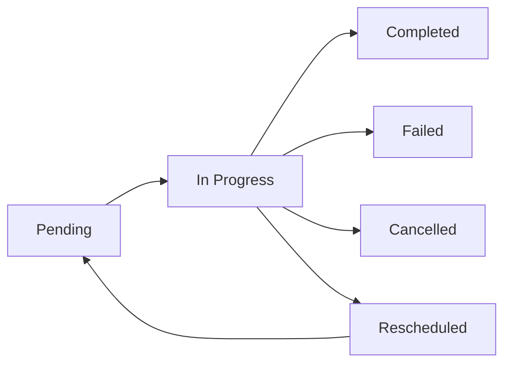

# ✅ Tareas

Las tareas en Reten representan los momentos de contacto planificados con los clientes, diseñados para alcanzar objetivos específicos en el ciclo de vida del cliente: adquisición, retención, reactivación y digitalización. Cada tarea define cómo, cuándo y a través de qué canal se realizará la interacción con el cliente.




{{ feature_card(
    'material-clipboard-list',
    'Tareas',
    'Instrucciones y momentos oportunos para contactar clientes',
    'README.md'
) }}

{{ feature_card(
    'material-chart-timeline',
    'Seguimiento',
    'Estado y progreso de tareas',
    'tracking/README.md'
) }}


## Características Comunes

Todas las tareas comparten:

- Identificación única y trazabilidad
- Objetivo específico de negocio
- Asignación a un responsable
- Ventana temporal de ejecución
- Métricas de éxito
- Seguimiento de estado
- Integración con canales de contacto

## Tipos de Tareas

### [Visitas](./visit/README.md)

Interacciones presenciales realizadas por vendedores.

- Planificación territorial
- Objetivos comerciales
- Captura de información en campo
- Integración con rutas y asignaciones


### [Llamadas](./call/README.md)

Contactos telefónicos realizados por el call center.

- Scripts de conversación
- Registro de resultados
- Seguimiento de intentos
- Programación de callbacks


### [Mensajería](./messaging/README.md)

Comunicaciones a través de canales digitales.

- WhatsApp Business
- Correo electrónico
- SMS
- Notificaciones push


## Objetivos de Contacto

### Adquisición
- Prospección de nuevos clientes
- Presentación de productos/servicios
- Activación inicial
- Registro de datos

### Retención
- Seguimiento regular
- Atención a necesidades
- Venta cruzada/incrementada
- Resolución de problemas

### Reactivación
- Recuperación de clientes inactivos
- Ofertas especiales
- Actualización de información
- Identificación de causas de abandono

### Digitalización
- Adopción de herramientas digitales
- Capacitación en plataforma
- Activación de funcionalidades
- Mejora de engagement digital

## Estados y Ciclo de Vida

### Estados de Tarea

- `pending`: Pendiente de inicio
- `in_progress`: En ejecución
- `completed`: Finalizada con éxito
- `failed`: No completada
- `cancelled`: Cancelada
- `rescheduled`: Reprogramada

### Transiciones



## Estructura de Datos Base

```json
{
  // Identificadores
  "task_id": "string",         // Identificador único de la tarea (not null)
  "external_id": "string",     // Identificador externo del cliente
  
  // Información básica
  "type": "string",           // Tipo de tarea (visit, call, message)
  "objective": "string",      // Objetivo (acquisition, retention, reactivation, digitalization)
  "priority": "number",       // Prioridad de la tarea (1-5)
  
  // Asignación
  "assignee": {
    "id": "string",          // ID del responsable
    "type": "string",        // Tipo (seller, agent, system)
    "name": "string"         // Nombre del responsable
  },

  // Cliente objetivo
  "client": {
    "id": "string",          // ID del cliente
    "name": "string",        // Nombre del cliente
    "segment": "string",     // Segmento del cliente
    "contact_info": {        // Información de contacto
      "channel": "string",   // Canal preferido
      "value": "string"      // Valor del contacto
    }
  },

  // Programación
  "schedule": {
    "start_date": "date",    // Fecha de inicio
    "end_date": "date",      // Fecha límite
    "duration": "number",    // Duración estimada (minutos)
    "time_zone": "string"    // Zona horaria
  },

  // Configuración
  "settings": {
    "channel_config": {},    // Configuración específica del canal
    "retry_policy": {},      // Política de reintentos
    "success_criteria": {}   // Criterios de éxito
  },

  // Estado y resultados
  "status": {
    "current": "string",     // Estado actual
    "history": [{           // Historial de estados
      "status": "string",
      "timestamp": "date",
      "reason": "string"
    }]
  },
  "results": {
    "outcome": "string",     // Resultado final
    "metrics": {},          // Métricas específicas
    "notes": "string"       // Notas o comentarios
  },

  // Marcas temporales
  "created_at": "timestamp", // Fecha de creación
  "updated_at": "timestamp", // Última actualización
  "_created_at": "timestamp", // Fecha de creación en BigQuery
  "_updated_at": "timestamp"  // Última actualización en BigQuery
}
```

## Validaciones Principales

### Validaciones Generales
- Identificadores únicos por tarea
- Fechas válidas y coherentes
- Asignaciones a usuarios activos
- Clientes existentes y activos

### Validaciones por Tipo
- Visitas: coordenadas y rutas válidas
- Llamadas: números verificados
- Mensajes: canales habilitados

### Validaciones de Negocio
- Capacidad del asignado
- Horarios permitidos
- Frecuencia de contacto
- Permisos y consentimientos

## Integración con Otros Sistemas

### Dependencias
- Master Data (clientes, vendedores)
- Settings (rutas, asignaciones)
- Canales de comunicación

### APIs y Webhooks
- Creación y actualización
- Notificaciones de estado
- Resultados y métricas
- Eventos de sistema

## Consideraciones de Implementación

### Rendimiento
- Indexación de búsquedas frecuentes
- Caché de datos relacionados
- Optimización de consultas

### Seguridad
- Control de acceso por rol
- Encriptación de datos sensibles
- Auditoría de cambios

### Escalabilidad
- Procesamiento asíncrono
- Particionamiento de datos
- Balanceo de carga

Para más detalles sobre cada tipo de tarea, consulta su documentación específica en los enlaces proporcionados.
